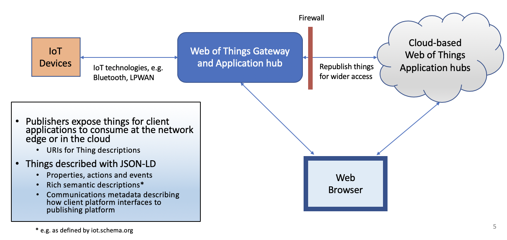

# Arena Web Hub for the Web of Things

Arena Web Hub is an open source implementation of a Web of Things application hub (i.e. a Web Hub) as a node module released under the MIT license to encourage widespread adoption. It integrates a Web server for access by Web browsers.

* If you have any questions please contact the maintainer: Dave Raggett <dsr@w3.org>

## Installation

You can install the Arena Web Hub is with npm using the command line:

```
npm arena-webhub
```

Alternatively, define a "[package.json](https://docs.npmjs.com/getting-started/using-a-package.json)" file for your application and use "npm install" to install the dependencies including the arena-webhub module. See the examples folder for some examples.

If you are interested in contributing to further development, including providing example applications and library modules for IoT technologies, you are encouraged to clone the GitHub project at <https://github.com/draggett/arena-webhub>.  If you have a GitHub account, you are also welcome to add to the issue tracker. See below for information on using the Web Hub.

Arena has minimal external dependencies and is compact with under 2000 lines of JavaScript. It makes use of the [jshashes node module](https://github.com/h2non/jshashes) for computing the SHA-1 based handshake used for upgrading from HTTPS to WSS. Applications are likely to have dependencies on other modules, e.g. for managing JSON Web Tokens, and for utilising IoT technologies like Bluetooth and ZigBee.

### Server certificates

The server looks for "cert.pem" and "key.pem" in the directory it is run in.  You can create self-signed certificates for "localhost" using openssl, e.g.

```
openssl req -newkey rsa:2048 -x509 -nodes -keyout key.pem -new -out cert.pem -subj /CN=localhost -reqexts SAN -extensions SAN -config <(cat /System/Library/OpenSSL/openssl.cnf \
    <(printf '[SAN]\nsubjectAltName=DNS:localhost')) -sha256 -days 3650
```

Note that browsers will warn users that a secure connection cannot be made.

On Chrome you can inform the browser that you trust this certificate.

On Safari you will need to follow these steps:

1.	Locate where your certificate file is. It is likely to be
  somewhere near your web server configurations.
2.	Open up Keychain Access. You can get to it from
  Application/Utilities/Keychain Access.app.
3.	Drag your certificate into Keychain Access.
4.	Go into the Certificates section and locate the certificate you just added
5.	Double click on it, enter the trust section and under
  “When using this certificate” select “Always Trust”

## Examples

You can find examples of how to use the Web Hub in the examples folder. This includes a client-side library (wot.js) that provides a client-side API and can be used within Web pages or as part of of node application, and may even be used as part of a Web Hub along with this module. Other examples illustrate how the Web of Things can be applied to automation and to medical applications. You are invited to provide further examples, with a view to providing a broad collection of use cases.  Note that applications can take advantage of a range of node modules for common technologies for connecting to IoT devices, e.g. Bluetooth, ZigBee, Z-Wave, NFC, CoAP, etc.

## Security and user account management

Arena supports HTTPS, Server-Sent Events and Web Sockets (WSS) over the same IP port with transport layer encryption and JSON Web Tokens (JWT) for authorisation. Applications are responsible for managing user accounts, generating, validating and revoking JSON Web Tokens. To support account management, applications are responsible for handling HTTPS requests under a configurable top level path (the default is "/account"). Validation of JSON Web Tokens must be implemented via an application supplied call back.

Applications should provide a means for users to register accounts, to login or out, to review and update their account details, and to unregister as needed. JSON Web Tokens may be created when the user logs in and revoked when the user explicitly logs out or unregisters. Applications are recommended to use second factors as part of the process for activating new accounts. An email address can be sent a message with a time limited link that the user clicks on to activate the account. Alternatively, a mobile phone number may be sent an SMS with a randomly generated time limited numeric code that the user enter into the login page to activate the account.

The email address and mobile number may also be used by applications to send users notifications as appropriate, however this require the user's explicit approval and should be updateable as part of the user's account details. Applications are further required to conform with applicable data privacy regulations, such as Europe's GDPR, in respect to data handling policies.

## IoT technologies

Applications may use any suitable technologies for accessing IoT devices, e.g. Bluetooth and ZigBee, for which there are existing node modules. A similar situation applies to accessing devices belonging to particular ecosystems, e.g. Apple HomeKit, Android Things, the Open Connectivity Foundation (OCF) and oneM2M. A major benefit of the Web of Things is to shield client applications from the IoT technologies at the network edge.

### Future work under consideration

Any help with these would be welcomed.

* **Simplified thing API** where things look like regular JavaScript objects with getters and setters for properties, and object methods for actions. Attempts to write invalid values throws an exception, and asynchronous errors result in observable events, e.g. loss of connectivity. The simplified API will be implemented on top of the existing API.

* **Things as first class types** that can be passed to properties, actions and events. This will involve a new _supply_ method that is passed a thing description and returns a promise. Things are automatically published so there is no need for the expose method.
* **More efficient handling of high speed streams**, allowing you to read and write data in blocks rather than having to do so one data point at a time.  The protocols will be able to choose how to best buffer data for maximum performance.
* **Peer to peer to peer networks of Web Hubs**, where these may be behind different firewalls. W3C's [WebRTC](https://www.w3.org/TR/webrtc/) standard is designed for peer to peer data transfer and is supported by Web browsers.
* **Enlarged set of example applications** for different domains, IoT technologies and standards. 

Note that the examples include a client-side Web of Things library (see "[client/wot.js](client/wot.js)") with an adaptation layer for different Web of Things platforms.

## Web of Things

The IoT is fragmented by incompatible platforms, and myriad technologies and standards. This creates market friction through raising costs and risks. W3C's Web of Things addresses this by introducing an abstraction layer with things that stand for sensors, actuators and associated information services. 

* Server applications expose things, hiding the details of the IoT technologies and standards
* Client applications interact with things as software objects with properties, actions and events
* Things are identified with URLs that can be dereferenced to download machine interpretable descriptions as JSON-LD and optionally as documentation in HTML
* RDF and Linked Data can be used for rich descriptions of the kinds of things, their capabilities, interrelationships, and the context in which they reside. As an example, a smart home could be described in terms of the different kinds of smart lights in each room.



Web Hubs are an important new class of Web application platforms that enable open markets of services where suppliers and consumers of services are connected via the Web of Things using Web protocols for easy integration with Web browsers and other Web Hubs.

Web of Things platforms vary in which protocols they support and exactly how they use them. Server platforms inject communications metadata into thing descriptions for the things they expose  as a basis for client platforms to identify how to interoperate with them. 

Arena identifies itself to clients in thing descriptions with the following metadata declaration:

```
"platform": "https://github.com/draggett/arena-webhub"
```

## 

## Usage

You are encouraged to look at the examples folder for example applications.

```javascript
let webhub = require('arena-webhub')({
	port: 8888,
	accountPath: '/account',
	accountManager: function (request, response) {
        // handle HTTPS client
    },
    validateJWT: function (jwt, path) {
        // verify JSON Web Token returning true or false
    }
});
```

The port and account path are optional and default to 8888 and "/account". The accountManager and validateJWT are required application callbacks. The accountManager callback is passed two arguments for the HTTPS request and response (see the HTTPS node module), and is responsible for handling the request and the associated response. The validateJWT callback is passed two arguments for the JSON Web Token and the URL path for the connection. The return value is true if the token is currently valid for this path, or false if it isn't.

The Arena Web Hub module exports a single function for applications to expose things for access by clients. The _produce_ method is passed a thing description as a JSON object and returns a promise for the exposed thing, for example:

```javascript
let thing = webhub.produce({
    name: "light12",
    description: "hall light"
    properties: {
        brightness: {
            type: "integer",
            minimum: 0,
            maximum: 100
        }
    },
    actions: {
    },
    events: {   
    }
});

// initialise thing's behavior
// e.g. declare action handlers
...

thing.expose();  // expose thing to clients
```

## Integrated Web Server

Web applications for access from Web browsers involve a set of  Web page resources. The Arena Web Hub looks for these in the "./www" folder. The integrated Web server will serve up the file at "./www/index.html" for URL GET requests with the path "/".  Applications are responsible for managing Web resources  for the Web server. This includes web page scripts and their use of cookies.

## Thing Descriptions

The object interface for things is described using JSON-LD with a default context. Arena Web Hub follows the W3C Thing Description specification, see: https://www.w3.org/TR/wot-thing-description/

Note that the specification is still evolving, and the Arena Web Hub may not be fully compliant to the latest version of the [editor's draft specification](https://w3c.github.io/wot-thing-description/). An example is that Arena doesn't currently support protocol binding templates using "forms". This is because protocol binding templates aren't yet capable of a complete description of Arena's use of HTTPS, Server-Sent Events and WebSockets.

## Thing API

This section describes the API exposed by the Arena Web Hub for server-side applications. 

Each thing exposes the following interface:

```javascript
class Thing {
	id // string - a unique id for the thing
	name // string - a human friendly name for the  thing
	model // JSON object for the thing description
	properties // object - a map from name to property
	actions // object - a map from name to action
	events // object - a map from name to event
	addActionHandler(name, callback) // set callback for named action
}
```

Properties expose the following interface:

```javascript
class ThingProperty {
	thing // the thing this property belongs to
	name // the name of this property
	value // the current value of this property
	write(value) // to update the current value and notify clients
	subscribe(observer) // add observer to list of observers
	unsubscribe(observer) // remove observer from list of observers
}

// an example handler for a property observer
function observer (data) {
	// notification of updated value for property
}
```

Actions expose the following interface, where optional timeout is in milliseconds, and the handler to be called is set using addActionHandler, see above, where the callback takes a single argument with the input for the action, and returns a promise that resolves to the output from the action.

```javascript
class ThingAction {
	thing // the thing this property belongs to
	name // the name of this property
	invoke(input [,timeout]) // invoke with input, returns promise for the output
}
```

Events expose the following interface:

```javascript
class ThingEvent {
	thing // the thing this property belongs to
	name // the name of this event
	emit(data) // to notify clients of this event with given data
	subscribe(observer) // add observer to list of observers
	unsubscribe(observer) // remove observer from list of observers
}

// an example handler for an event observer
function observer (data) {
	// notification of updated value for property
}
```

### Remote Access

A common situation is where the hub that is exposing a thing is behind a firewall and wants to make it available to applications outside of the firewall, which are blocked by the firewall from connecting as regular clients. The Arena Web Hub can be used in the following ways:

* As the hub behind the firewall with an application that seeks to expose a thing remotely

  * This application needs to get authorisation for the remote access from the external hub which should return the URI for a Web Socket (WSS) connection along with the JASON Web Token (JWT)  for use when establishing that connection.

  * The application can then ask the hub to open and add the connection for the given thing. The promise resolves to the new WebSocket connection when it has been established.

    ``` javascript
    thing.addRemoteClient(wss_uri, jwt)  // returns promise for the connection
    ```

* As a hub outside of the firewall that republishes (i.e. proxies) a thing from behind the firewall

  * The application on this hub needs to authorise the proxying of things from behind the firewall using the URL space it reserved when configuring the hub.

  	```javascript
  	thing.proxy(jwt);  // republish the thing that connects using this token
  	```

* As a hub outside of the firewall that acts as the sole client for a thing exposed behind the firewall, for example, where a device vendor seeks to monitor the operation of a device in order to provide predictive maintenance.

  * The application on this hub needs to designate the JSON Web Token that will be used by the remote hub that owns the thing

    ```javascript
    thing.setOwner(jwt); // provide access to the thing that uses this token
    ```

## Protocols

This section describes how the Arena Web Hub makes use of HTTPS, Server-Sent Events and WebSockets. In practice, this is implemented as a client-side library that hides the protocols behind a simple API. See "wot.js" in the examples folder for a library that also supports Siemens' ThingWeb and Mozilla's Things Gateway platforms. Note that the client side API needs a means for applications to subscribe and unsubscribe to events as this is required for some protocols but not others.

Clients access thing descriptions with an HTTPS GET request with  JWT for authorisation.

```javascript
const uri = "https://localhost:8888/things/light12";
const opts = {
	method: "GET",
	headers: {
		'Authorization': `Bearer ${jwt}`,
		'Accept': 'application/json'
	}
};

fetch(uri, opts).then(response => {
	if (response.ok) {
		resolve(response.json());
	}
	else
		throw(new Error("response status = " + response.status));
}).catch(err => {
	console.log("couldn't get thing description at " + uri);
	reject(err);
});
```

Clients can request the set of currently exposed things with a GET to "/things" which returns a JSON array where the items are the thing descriptions for each exposed thing.  This requires JWT for authorisation.

Clients may use GET for a given property, e.g.

```javascript
const uri = "https://localhost:8888/things/light12/properties/brightness";
const opts = {
	method: "GET",
	headers: {
		'Authorization': `Bearer ${jwt}`,
		'Accept': 'application/json'
	}
};

fetch(uri, opts).then(response => {
	if (response.ok) {
		resolve(response.json());
	}
	else
		throw(new Error("response status = " + response.status));
}).catch(err => {
	console.log("couldn't get thing description at " + uri);
	reject(err);
});
```

Clients may also request the current state for all the properties as a JSON object:

```javascript
const uri = "https://localhost:8888/things/light12/properties";
const opts = {
	method: "GET",
	headers: {
		'Authorization': `Bearer ${jwt}`,
		'Accept': 'application/json'
	}
};

fetch(uri, opts).then(response => {
	if (response.ok) {
		resolve(response.json());
	}
	else
		throw(new Error("response status = " + response.status));
}).catch(err => {
	console.log("couldn't get thing description at " + uri);
	reject(err);
});
```

To update the value of a property, clients can use a PUT on the path for the property with the new value encoded as JSON as the body of the request, e.g.

```javascript
const uri = "https://localhost:8888/things/light12/properties/brightness";
console.log('uri: ' + uri);

const opts = {
	method: "PUT",
	headers: {
        'Authorization': `Bearer ${jwt}`,
		'Accept': 'application/json',
		'Content-Type': 'application/json'
	},
	body: JSON.stringify(value)
};

fetch(uri, opts).then(response => {
	if (response.ok)
		resolve(true);
	else
		throw(new Error("property is unknown or unwritable"));
}).catch(err => {
	console.log("couldn't set property to " + JSON.stringify(value));
	reject(err);
});
```

Clients can update the value for multiple properties with a PUT to the path "/properties" with body as a JSON object with the corresponding properties and their new values.

To invoke an actions clients may send an HTTP POST request to the path for the action with the body as the JSON representation of the input data to be passed to the action. The response body contains the JSON representation of the output of the action. For example:

```javascript
const uri = "https://localhost:8888/things/light12/actions/dim";
console.log('uri: ' + uri);

const opts = {
	method: "POST",
	headers: {
        'Authorization': `Bearer ${jwt}`,
		'Accept': 'application/json',
		'Content-Type': 'application/json'
	},
	body: JSON.stringify(input)
};

fetch(uri, opts).then(response => {
	if (response.ok)
		resolve(response.json());
	else
		throw(new Error("action is unknown or disallowed"));
}).catch(err => {
	console.log("couldn't invoke action with " + JSON.stringify(input));
	reject(err);
});
```

Note that Arena will reject data that doesn't match the constraints in the thing description whether this comes from the server or from client applications.

Clients may listen for all events using server-sent events on the path "/events". The stream sends either a regular event as declared in the thing description, or a notification of a new value for a property, or for a set of such properties, e.g.

```javascript
let eventSource = new
	EventSource(`https://localhost:8888/things/light12/events?jwt=${jwt}`);

eventSource.onmessage = function(e) {
	console.log("received event: " + e.data);
	let data = JSON.parse(e.data);
	
	if (data.event) {
		let eventName = data.event;
		let eventValue = data.data;
	} else if (data.property) {
        let propertyName = data.property;
        let propertyValue = data.data;
	} else if (data.state) {
		// data.state is an object mapping property names to values
	}
}
```

Alternatively clients can use HTTPS GET in long polling mode on a particular event, or property, e.g.

```javascript
const uri = thing_uri + '/events/' + name;

var poll = function () {
	const opts = {
		method: "GET",
		headers: {
			'Accept': 'application/json'
		}
	};

	fetch(uri)
		.then(res => res.json())
		.then(value => {
			//console.log(name + ': ' + JSON.stringify(value));
			if (handler) {
				handler(value);
			}
			setTimeout(poll, 0); // to wait for next event
		}).catch(err => {
			console.log("couldn't get event from " + uri);
		});
};

setTimeout(poll, 0);  // kick off polling
```

### Using Web Sockets

This version of the Arena Web Hub assumes a single Web Socket connection per thing. In future, you will be able to share the connection by opening the Web Socket server on the "/things" path rather than on the path for a specific thing.

Here's an example of  how to open a Web Socket for a particular thing.

```javascript
let thing_uri = "https://localhost:8888/things/light12";
let ws = new WebSocket(`${thing_uri}?jwt=${jwt}`);
    	
console.log("websocket connection opening ...");

ws.onopen = function() {
	console.log("websocket connection opened");
};

ws.onclose = function() {
	console.log("websocket connection closed");
};

ws.onerror = function() {
	console.log("websocket connection error");
};

ws.onmessage = function(message) {
	console.log("received message: " + message.data);
	try {
		let data = JSON.parse(e.data);

		if (data.event) {
			let eventName = data.event;
			let eventValue = data.data;
			// do something with event
		} else if (data.property) {
			let propertyName = data.property;
			let propertyValue = data.data;
			// do something with property update
		} else if (data.state) {
			// data.state is an object mapping property names to values
        } else if (data.status) {
			// a response to a client request
			let id = data.id;  // identifies client request
			let status = data.status; // same codes as for HTTP
			// match response to request and do something 
        }
        
	} catch (err) {
		console.log('badly formed message: ' + message.data)
	}
};
```

Clients can push property updates individually or together:

```javascript
let message = {
	id: 23,
	property: "brightness",
	data: 42
};
ws.send(JSON.stringify(message));

message = {
	id: 24,
	state: {
		property1: value1,
		property2: value2,
		...
	}
};
ws.send(JSON.stringify(message));
```

The id should uniquely identify each request and is used to match the request to the response sent by the server. A simple approach is to associate a counter with the connection and increment for each request. Care is needed when re-opening a socket as the server may send responses for requests received with the previous connection.

The server response looks like the following:

```javascript
// a successul transaction
{
	id: 23,
	status: 200
}

// a failed transaction (invalid data)
{
	id: 23,
	status: 400
	description: "invalid data"
}
```

The status codes are the same as for the HTTP protocol. The description field is optional.

Clients can invoke actions and handle the responses as follows:

```javascript
// invoke action'start' with input data 13
{
	id: 71,
	action: "start",
	input: 13
}

// a successful action response with output true looks like
{
	id: 71,
	status: 200,
	output: true
}

// a failed action looks like
{
	id: 71,
	status: 500,
	description: "server error"
}
```

Arena will check that the input and output match the type declarations in the thing description. The action will fail if either of these are invalid, or if the action name is not declared in the thing description.  If the action handler itself fails, it can either reject the promise or it can resolve the promise and use output to describe the failure.  Note that if the server application code throws an exception, this will result in a failed action as above.