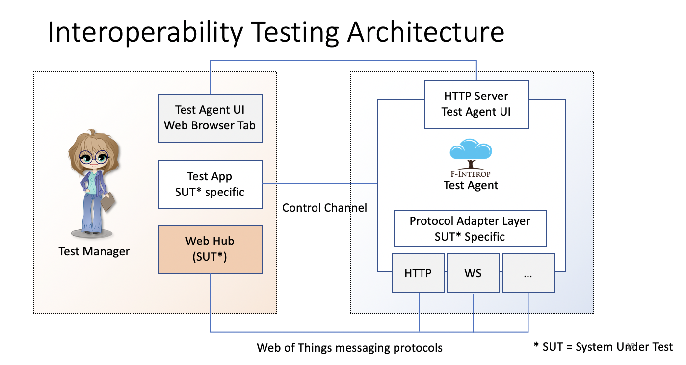
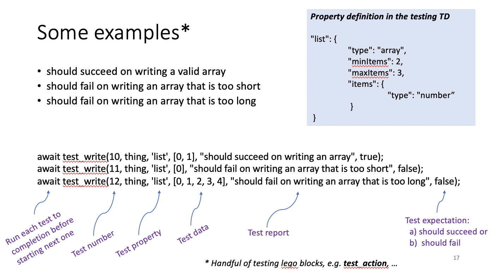

# High-level interoperability testing for the Web of Things

<div style="background-color:#EEE;padding:0.5em;height:6em">
     Acknowledgement: This work was done as part of the <a href="https://www.f-interop.eu">F-Interop project</a> which was supported by the European Union’s Horizon 2020 programme under Grant Agreement number: 687884
</div>


This example provides a tool for high-level interoperability testing for the Web of Things.  This has been used for testing Arena Web Hub, Siemens' Eclipse ThingWeb and Mozilla's IoT Things Gateway. The testing tool was co-developed with the Arena Web Hub as part of a test-driven development process.



The test agent assumes a server platform that exposes a thing, and a client platform that consumes a thing. A special test thing is used to support the suite of tests, along with the corresponding server and client test applications.

The test agent is implemented as a web page script ([www/interop.js](www/interop.js)) along with a client library for the Web of Things ([www/wot.js](www/wot.js)) that provides a server platform neutral API with adaptors for common platforms for how they use the underlying protocols. The test agent is designed to implement:

* Client-side functional tests
* Server-side functional tests
* Non-functional tests - for now just performance

The following illustrates how tests are expressed within the test agent. The example focuses on testing the client-side platform's ability to handle properties whose value is declared in the thing description as an array with constraints on the number of items in the array.



The first test has the expected number of array items, each of which have the expected data type (number). This test should succeed. The second test has too few items and should fail. The third test has too many array items and likewise should fail. Here are some further examples of tests:

* Test that the property of a consumed thing is the same as for the exposed thing
	* Query property value of exposed thing (request/response)
	* Query property value of consumed thing (request/response)
	* Test that the values are the same (after rendezvous for asynch responses)
* Test that a property update on an exposed thing signals the corresponding event
	* Set property value of exposed thing
	* Listen for corresponding update event from exposed thing
* Test that a property update on a consumed thing signals the corresponding event
	* Set property value of consumed thing
	* Listen for corresponding update event from consumed thing
* Test that setting unknown property triggers exception
	* Set value for unknown property of consumed thing
	* Listen for corresponding exception from consumed thing
* Test trying to set an invalid property value for some example data types
	* Set invalid property value of consumed thing

* Listen for corresponding exception from consumed thing

_And similarly for actions and events …_

## How to run the tests

* The first step is to clone the repository, e.g. using the command

  ```
  git clone https://github.com/draggett/arena-webhub
  ```

  You should then change directory to "examples/Interop Testing" and run the command

  ```
  npm install
  ```

  to install dependencies and you should then start the server with the command

  ```
  npm start
  ```

  This runs the Web Hub on the application defined by "[arena-webhub.js](arena-webhub.js)" and is equivalent to running the command "node arena-webhub.js" . You should then use a web browser to open the web application at https://localhost:8888/interop.html.  The web page offers a choice of platforms to run the tests on. The first choice is the Arena Web Hub using Web Sockets. The second choice is the Arena Web Hub using Server Sent Events. The next choice is the Siemens node-wot server (from the Eclipse ThingWeb project) using long polling for events. 

- To test the Siemens node-wot platform, you need a second console to launch the server and get it to execute the test applications with the command

	```
	wot-servient thing-web-interop.js
	```

	Where the application script [thing-web-interop.js](thing-web-interop.js) is very similar to  "arena-webhub.js", differing in only a few contextual details.

- The Mozilla Things Gateway is more complicated. After installing it from the Mozilla site, you need to create a user account and install a test add-on. Once that is done, you can then log into the Things Gateway, enable the test add-on and activate the test thing. _The addon code is under development and will be uploaded soon_.

